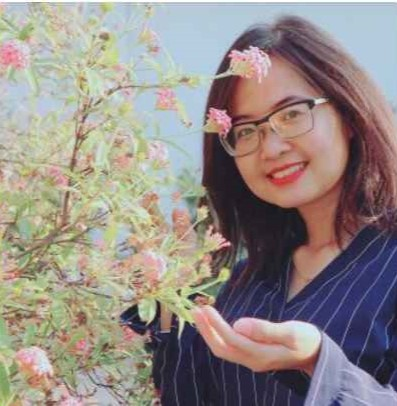
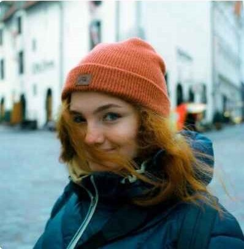

# User Personas

<!-- some introduction -->

---

<!-- a persona -->

## Carrol, 43

- **Her name's Carrol, she's 43 y.o. and she has taken care about garden almost
  10 years.**
- **She need's to find a solution to the problem as soon as possible in order to
  save her trees.**
- **She still has a problem with groving of some of tree in her garden, so she's
  just looking for info and wanna choose the way of solving these problems**
- **She's a nature lover and wants to take care of her garden, and after her
  work she has no time to look for information that could help her, and her love
  for her garden drives her to look for quick solutions in one place.**

---

## Lillian, 17

- **Her name's Lillian and she's first year student at biological university.**
- **She needs to find more info about trees in short term for her projeсt.**

- **She has to prepare her first presentation, and she doesn't know where to
  find the information, the books she has read all seem complicated, so she's
  looking for a site where she can find basic information to help her develop
  her project.**

- **She's looking for new facts about tree and this site she likes more, cos
  there only important info. So she doesn't need spend a lot of time for
  reading.**
